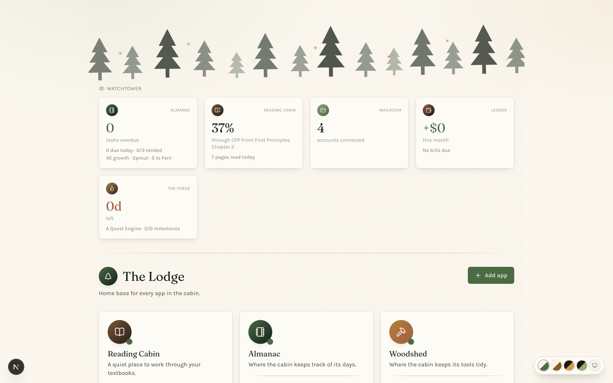

# The Lodge

> Where the cabin's doors all open from.

Home base for a set of small, local-first apps that share one design language. The Lodge starts and stops each one, shows which are running, and pulls a live glance of what's happening inside them onto a single page.



## What it does

**Launcher.** Every app is an entry in `data/apps.json` — name, tagline, path, command, port. The Lodge spawns each one as a detached process, tracks the PIDs in `.runtime/pids.json`, and tails their logs, so starting your whole workspace is one click per app instead of one terminal tab per app.

**Watchtower.** A row of cards across the top, each showing the one number that app would want you to see: tasks overdue in Almanac, percent through the current textbook in Reading Cabin, days left on the active Forge project, net for the month in Ledger.

The Watchtower reads each app's own public `/api/summary` endpoint over plain HTTP — short timeout, failure caught. No shared database, no shared code, no imports between apps. An app that's switched off simply doesn't report, and the card quietly goes idle instead of erroring. That constraint is deliberate: every app in the cabin stays independently runnable, and the integration is the thinnest thing that could work.

## Stack

Next.js 16 (App Router) · React 19 · TypeScript · Tailwind 4. No database — app definitions live in `data/apps.json`, runtime state in `.runtime/`.

## Running it

```bash
npm install
cp data/apps.example.json data/apps.local.json   # then edit the paths to match your machine
npm run dev
```

Then open <http://localhost:4000>.

`data/apps.local.json` is gitignored — it holds absolute paths specific to your machine, so it stays out of the repo. The committed `apps.example.json` is the template.

## The cabin

[Reading Cabin](https://github.com/CamWhamBammus/reading-cabin) · [Almanac](https://github.com/CamWhamBammus/almanac) · [Woodshed](https://github.com/CamWhamBammus/woodshed) · [Mailroom](https://github.com/CamWhamBammus/mailroom) · [Ledger](https://github.com/CamWhamBammus/ledger) · [The Forge](https://github.com/CamWhamBammus/the-forge) · [The Foundry](https://github.com/CamWhamBammus/the-foundry)
